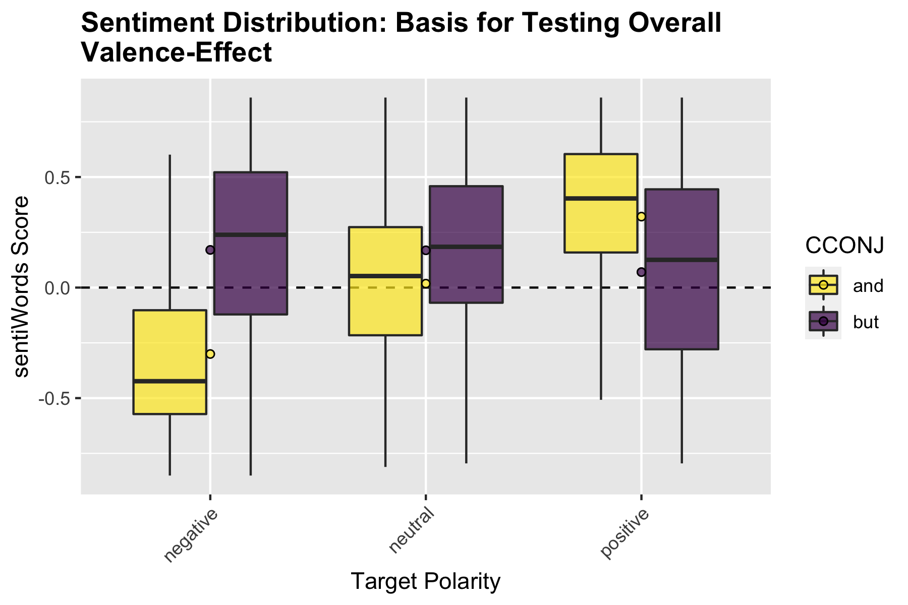
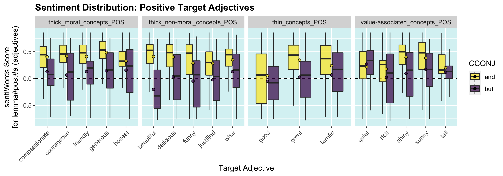
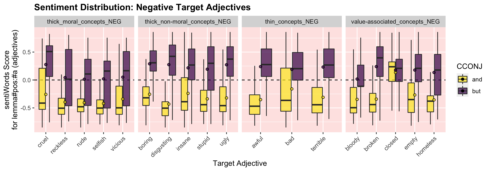
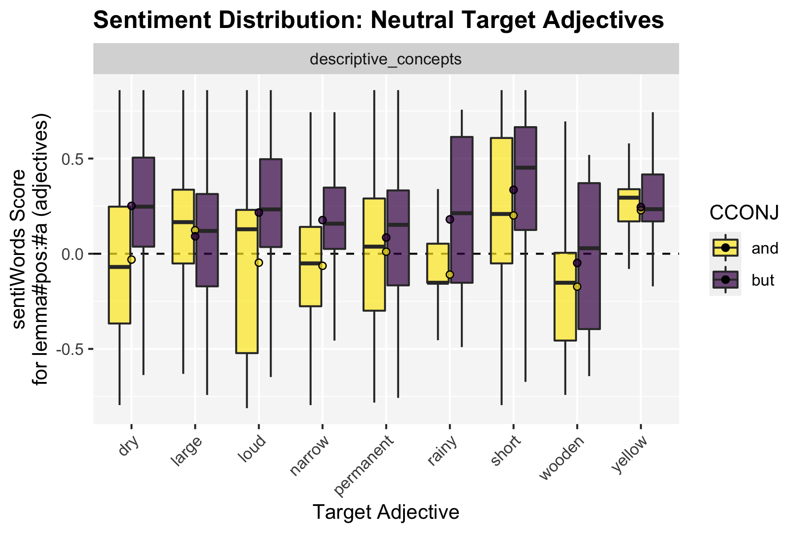

README
================
Lucien Baumgartner
8/12/2020

  - [The Project](#the-project)
  - [Study 1: Valence - Proof of
    Concept](#study-1-valence---proof-of-concept)
      - [Data](#data)
      - [Hypotheses](#hypotheses)
      - [Results](#results)
          - [Testing H1a-d](#testing-h1a-d)
          - [Testing H2a-b](#testing-h2a-b)
          - [Additional Material](#additional-material)
              - [Overview of the Pooled
                Subsample](#overview-of-the-pooled-subsample)
              - [Do the Target Categories have Significantly Different
                Average *Absolute*
                Valences?](#do-the-target-categories-have-significantly-different-average-absolute-valences)
              - [Do the Target Categories have Significantly Different
                Average *Polar*
                Valences?](#do-the-target-categories-have-significantly-different-average-polar-valences)

# The Project

So far we lack the means to distinguish thick concepts from descriptive
concepts without relying on intuitions, and to measure evaluative
intensity. Using a corpus-based approach, we show that thick adjectives
and descriptive adjectives behave differently when being combined with
the terms “and” and “but”. After having shown the validity of our
approach, we show how this method can help to answer questions in
different domains of discourse: We provide empirical data revealing that
thick concepts are used differently in legal contexts compared to
everyday language.

# Study 1: Valence - Proof of Concept

## Data

The data for the first study are 600’000+ reddit comments, of which we
took a subsample of 5000 occurrences for each target adjectives (45) in
combination with the respective conjunction (2). Accordingly, the pooled
subsamples consist of (45x2x5000=) 450’000 comments.

## Hypotheses

**H1: Valence for pos/neg target adjectives**

  - H1a: neg x but = pos
  - H1b: neg x and = neg
  - H1c: pos x but = neg
  - H1d: pos x and = pos

**H2: Comparative neutral valence**

  - H2a: neut x and \> neg x and
  - H2b: neut x and \< pos x and

## Results

### Testing H1a-d

  - H1a: neg x but = pos :white\_check\_mark:
  - H1b: neg x and = neg :white\_check\_mark:
  - ~~H1c: pos x but = neg~~ :negative\_squared\_cross\_mark:
  - H1d: pos x and = pos :white\_check\_mark:

**H\_A: fitted mean greater than 0**

<pre>
CCONJ = and:
 TARGET_pol  emmean      SE     df t.ratio  p.value
 negative   -0.3004 0.00130 449994 -231.505 1.0000 
 neutral     0.0178 0.00184 449994    9.724 <.0001 
 <b>positive    0.3210 0.00130 449994  247.361 <.0001</b> 

CCONJ = but:
 TARGET_pol  emmean      SE     df t.ratio  p.value
 <b>negative    0.1703 0.00130 449994  131.230 <.0001</b> 
 neutral     0.1686 0.00184 449994   91.866 <.0001 
 positive    0.0700 0.00130 449994   53.910 <.0001 

P values are right-tailed 
</pre>

**H\_A: fitted mean smaller than 0**

<pre>
CCONJ = and:
 TARGET_pol  emmean      SE     df t.ratio  p.value
 <b>negative   -0.3004 0.00130 449994 -231.505 <.0001</b>  
 neutral     0.0178 0.00184 449994    9.724 1.0000 
 positive    0.3210 0.00130 449994  247.361 1.0000 

CCONJ = but:
 TARGET_pol  emmean      SE     df t.ratio  p.value
 negative    0.1703 0.00130 449994  131.230 1.0000 
 neutral     0.1686 0.00184 449994   91.866 1.0000 
 <b>positive    0.0700 0.00130 449994   53.910 1.0000</b>  

P values are left-tailed 
</pre>

### Testing H2a-b

  - H2a: neut x and \> neg x and :white\_check\_mark:
  - H2b: neut x and \< pos x and :white\_check\_mark:

**effect sizes two sided**

<pre>
CCONJ = and:
 TARGET_pol  emmean      SE     df lower.CL upper.CL
 negative   <b>-0.3004</b> 0.00130 449994  -0.3030  -0.2979
 neutral     <b>0.0178</b> 0.00184 449994   0.0143   0.0214
 positive    <b>0.3210</b> 0.00130 449994   0.3185   0.3236
</pre>

**pairwise comparisons**

<pre>
CCONJ = and:
 contrast            estimate      SE     df t.ratio  p.value
 <b>negative - neutral   -0.3183 0.00225 449994 -141.599 <.0001</b> 
 negative - positive  -0.6215 0.00184 449994 -338.609 <.0001 
 <b>neutral - positive   -0.3032 0.00225 449994 -134.874 <.0001</b> 
</pre>

### Additional Material

#### Overview of the Pooled Subsample

#### Do the Target Categories have Significantly Different Average *Absolute* Valences?

I quickly checked whether the interaction between the categories of our
target adjectives and the conjunction produces significant valence
effects. As we can see, the categories do indeed occupy different
valence strata. Thin concepts, however, have a surprisingly high
estimated average valence in AND-conjunctions, even higher than thick
concepts (moral and non-moral). This is rather unexpected. In
BUT-conjunction, on the other hand, thin concepts behave as expected and
have lower average valence than thick conepts. Also note that moral and
non-moral thick concepts occupy a similar strata and could maybe be
combined in the future.

Results of the ANOVA:

<b>m1 \<- aov(abs(sentiWords) \~ cat\*CCONJ, data = dfx\_sample)</b>

<pre>
CCONJ = and:
 contrast                                                 estimate      SE     df t.ratio  p.value
 descriptive_concepts - thick_moral_concepts              -0.14493 0.00138 449990 -104.899 <.0001 
 descriptive_concepts - (thick_non-moral_concepts)        -0.13761 0.00138 449990  -99.603 <.0001 
 descriptive_concepts - thin_concepts                     -0.15856 0.00158 449990 -100.053 <.0001 
 descriptive_concepts - (value-associated_concepts)       -0.09289 0.00138 449990  -67.235 <.0001 
 thick_moral_concepts - (thick_non-moral_concepts)         0.00732 0.00134 449990    5.442 <.0001 
 thick_moral_concepts - thin_concepts                     -0.01364 0.00155 449990   -8.782 <.0001 
 thick_moral_concepts - (value-associated_concepts)        0.05204 0.00134 449990   38.696 <.0001 
 (thick_non-moral_concepts) - thin_concepts               -0.02095 0.00155 449990  -13.494 <.0001 
 (thick_non-moral_concepts) - (value-associated_concepts)  0.04472 0.00134 449990   33.254 <.0001 
 thin_concepts - (value-associated_concepts)               0.06567 0.00155 449990   42.293 <.0001 

CCONJ = but:
 contrast                                                 estimate      SE     df t.ratio  p.value
 descriptive_concepts - thick_moral_concepts              -0.05375 0.00138 449990  -38.908 <.0001 
 descriptive_concepts - (thick_non-moral_concepts)        -0.05782 0.00138 449990  -41.850 <.0001 
 descriptive_concepts - thin_concepts                     -0.02836 0.00158 449990  -17.893 <.0001 
 descriptive_concepts - (value-associated_concepts)       -0.01830 0.00138 449990  -13.243 <.0001 
 thick_moral_concepts - (thick_non-moral_concepts)        -0.00407 0.00134 449990   -3.023 0.0211 
 thick_moral_concepts - thin_concepts                      0.02540 0.00155 449990   16.357 <.0001 
 thick_moral_concepts - (value-associated_concepts)        0.03546 0.00134 449990   26.367 <.0001 
 (thick_non-moral_concepts) - thin_concepts                0.02946 0.00155 449990   18.975 <.0001 
 (thick_non-moral_concepts) - (value-associated_concepts)  0.03952 0.00134 449990   29.391 <.0001 
 thin_concepts - (value-associated_concepts)               0.01006 0.00155 449990    6.478 <.0001 

Note: contrasts are still on the abs scale 
P value adjustment: tukey method for comparing a family of 5 estimates 
</pre>

#### Do the Target Categories have Significantly Different Average *Polar* Valences?

I also briefly had a look whether the results make sense, once we
substitute *absolute* sentiment values with *polar* values. Overall,
there is no overlap between conjunctions within a polarity group, which
is a good sign. The two types of thick concepts (moral/non-m.) do not
behave similarly anymore, in contrast to the analysis above using
absolute valence measures. This speaks against collapsing the types into
a single category.

Results of the ANOVA:

<b> m1 \<- aov(sentiWords \~ (cat x TARGET\_pol)\*CCONJ, data =
dfx\_sample\[\!dfx\_sample$cat == ‘descriptive\_concepts’,\])</b>

<pre>
CCONJ = and:
 contrast                                                          estimate      SE     df t.ratio  p.value
 thick_moral_concepts_NEG - thick_moral_concepts_POS                -0.7712 0.00349 359984 -221.078 <.0001 
 thick_moral_concepts_NEG - (thick_non-moral_concepts_NEG)          -0.0497 0.00349 359984  -14.236 <.0001 
 thick_moral_concepts_NEG - (thick_non-moral_concepts_POS)          -0.7116 0.00349 359984 -203.997 <.0001 
 thick_moral_concepts_NEG - thin_concepts_NEG                       -0.0939 0.00403 359984  -23.305 <.0001 
 thick_moral_concepts_NEG - thin_concepts_POS                       -0.5838 0.00403 359984 -144.924 <.0001 
 thick_moral_concepts_NEG - (value-associated_concepts_NEG)         -0.1281 0.00349 359984  -36.706 <.0001 
 thick_moral_concepts_NEG - (value-associated_concepts_POS)         -0.6382 0.00349 359984 -182.937 <.0001 
 thick_moral_concepts_POS - (thick_non-moral_concepts_NEG)           0.7216 0.00349 359984  206.841 <.0001 
 thick_moral_concepts_POS - (thick_non-moral_concepts_POS)           0.0596 0.00349 359984   17.081 <.0001 
 thick_moral_concepts_POS - thin_concepts_NEG                        0.6774 0.00403 359984  168.154 <.0001 
 thick_moral_concepts_POS - thin_concepts_POS                        0.1875 0.00403 359984   46.535 <.0001 
 thick_moral_concepts_POS - (value-associated_concepts_NEG)          0.6432 0.00349 359984  184.371 <.0001 
 thick_moral_concepts_POS - (value-associated_concepts_POS)          0.1331 0.00349 359984   38.140 <.0001 
 (thick_non-moral_concepts_NEG) - (thick_non-moral_concepts_POS)    -0.6620 0.00349 359984 -189.761 <.0001 
 (thick_non-moral_concepts_NEG) - thin_concepts_NEG                 -0.0442 0.00403 359984  -10.976 <.0001 
 (thick_non-moral_concepts_NEG) - thin_concepts_POS                 -0.5341 0.00403 359984 -132.595 <.0001 
 (thick_non-moral_concepts_NEG) - (value-associated_concepts_NEG)   -0.0784 0.00349 359984  -22.470 <.0001 
 (thick_non-moral_concepts_NEG) - (value-associated_concepts_POS)   -0.5885 0.00349 359984 -168.701 <.0001 
 (thick_non-moral_concepts_POS) - thin_concepts_NEG                  0.6178 0.00403 359984  153.362 <.0001 
 (thick_non-moral_concepts_POS) - thin_concepts_POS                  0.1279 0.00403 359984   31.742 <.0001 
 (thick_non-moral_concepts_POS) - (value-associated_concepts_NEG)    0.5836 0.00349 359984  167.290 <.0001 
 (thick_non-moral_concepts_POS) - (value-associated_concepts_POS)    0.0735 0.00349 359984   21.060 <.0001 
 thin_concepts_NEG - thin_concepts_POS                              -0.4899 0.00450 359984 -108.779 <.0001 
 thin_concepts_NEG - (value-associated_concepts_NEG)                -0.0342 0.00403 359984   -8.484 <.0001 
 thin_concepts_NEG - (value-associated_concepts_POS)                -0.5443 0.00403 359984 -135.123 <.0001 
 thin_concepts_POS - (value-associated_concepts_NEG)                 0.4557 0.00403 359984  113.135 <.0001 
 thin_concepts_POS - (value-associated_concepts_POS)                -0.0544 0.00403 359984  -13.504 <.0001 
 (value-associated_concepts_NEG) - (value-associated_concepts_POS)  -0.5101 0.00349 359984 -146.231 <.0001 

CCONJ = but:
 contrast                                                          estimate      SE     df t.ratio  p.value
 thick_moral_concepts_NEG - thick_moral_concepts_POS                -0.0469 0.00349 359984  -13.449 <.0001 
 thick_moral_concepts_NEG - (thick_non-moral_concepts_NEG)          -0.1713 0.00349 359984  -49.117 <.0001 
 thick_moral_concepts_NEG - (thick_non-moral_concepts_POS)           0.1009 0.00349 359984   28.919 <.0001 
 thick_moral_concepts_NEG - thin_concepts_NEG                       -0.1411 0.00403 359984  -35.026 <.0001 
 thick_moral_concepts_NEG - thin_concepts_POS                        0.0631 0.00403 359984   15.676 <.0001 
 thick_moral_concepts_NEG - (value-associated_concepts_NEG)         -0.0711 0.00349 359984  -20.383 <.0001 
 thick_moral_concepts_NEG - (value-associated_concepts_POS)         -0.0577 0.00349 359984  -16.544 <.0001 
 thick_moral_concepts_POS - (thick_non-moral_concepts_NEG)          -0.1244 0.00349 359984  -35.668 <.0001 
 thick_moral_concepts_POS - (thick_non-moral_concepts_POS)           0.1478 0.00349 359984   42.368 <.0001 
 thick_moral_concepts_POS - thin_concepts_NEG                       -0.0942 0.00403 359984  -23.379 <.0001 
 thick_moral_concepts_POS - thin_concepts_POS                        0.1101 0.00403 359984   27.323 <.0001 
 thick_moral_concepts_POS - (value-associated_concepts_NEG)         -0.0242 0.00349 359984   -6.934 <.0001 
 thick_moral_concepts_POS - (value-associated_concepts_POS)         -0.0108 0.00349 359984   -3.095 0.0551 
 (thick_non-moral_concepts_NEG) - (thick_non-moral_concepts_POS)     0.2722 0.00349 359984   78.035 <.0001 
 (thick_non-moral_concepts_NEG) - thin_concepts_NEG                  0.0303 0.00403 359984    7.510 <.0001 
 (thick_non-moral_concepts_NEG) - thin_concepts_POS                  0.2345 0.00403 359984   58.212 <.0001 
 (thick_non-moral_concepts_NEG) - (value-associated_concepts_NEG)    0.1002 0.00349 359984   28.734 <.0001 
 (thick_non-moral_concepts_NEG) - (value-associated_concepts_POS)    0.1136 0.00349 359984   32.572 <.0001 
 (thick_non-moral_concepts_POS) - thin_concepts_NEG                 -0.2420 0.00403 359984  -60.070 <.0001 
 (thick_non-moral_concepts_POS) - thin_concepts_POS                 -0.0377 0.00403 359984   -9.368 <.0001 
 (thick_non-moral_concepts_POS) - (value-associated_concepts_NEG)   -0.1720 0.00349 359984  -49.302 <.0001 
 (thick_non-moral_concepts_POS) - (value-associated_concepts_POS)   -0.1586 0.00349 359984  -45.463 <.0001 
 thin_concepts_NEG - thin_concepts_POS                               0.2042 0.00450 359984   45.349 <.0001 
 thin_concepts_NEG - (value-associated_concepts_NEG)                 0.0700 0.00403 359984   17.374 <.0001 
 thin_concepts_NEG - (value-associated_concepts_POS)                 0.0834 0.00403 359984   20.698 <.0001 
 thin_concepts_POS - (value-associated_concepts_NEG)                -0.1343 0.00403 359984  -33.328 <.0001 
 thin_concepts_POS - (value-associated_concepts_POS)                -0.1209 0.00403 359984  -30.004 <.0001 
 (value-associated_concepts_NEG) - (value-associated_concepts_POS)   0.0134 0.00349 359984    3.839 0.0035 

P value adjustment: bonferroni method for 28 tests 
</pre>
