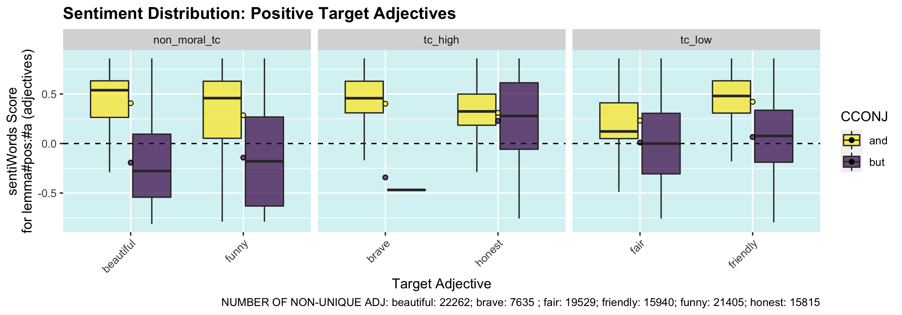
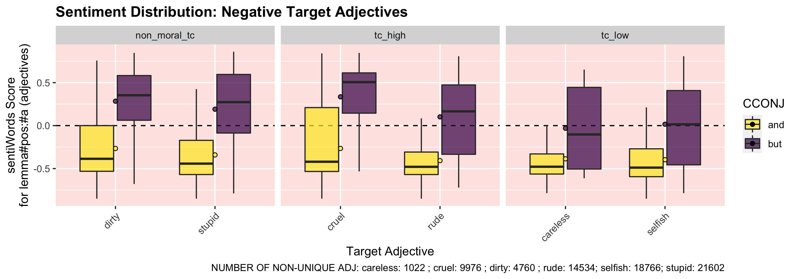
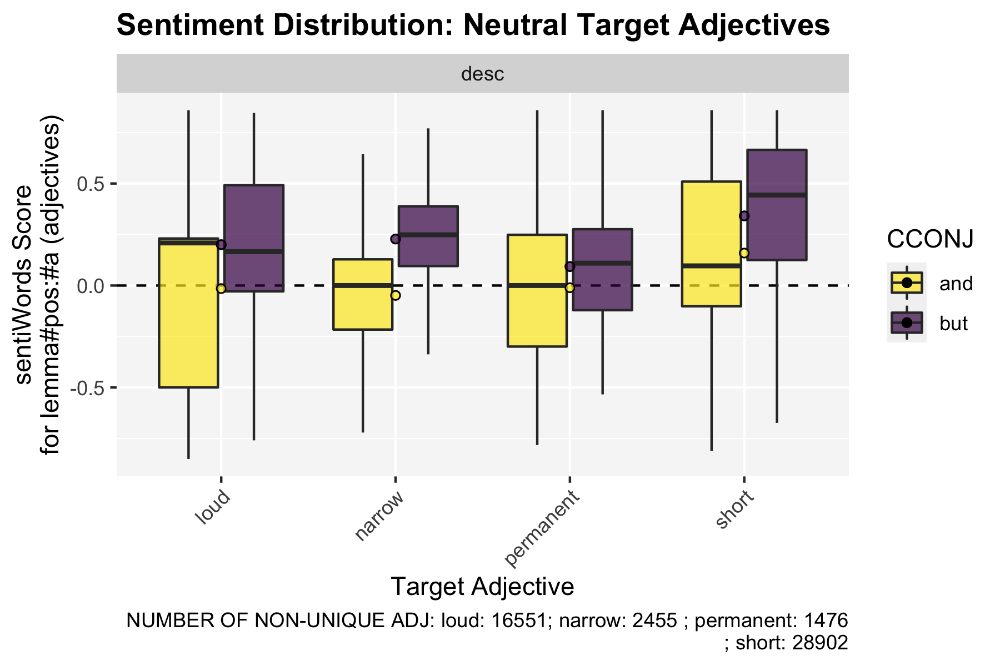

README
================
Lucien Baumgartner
8/12/2020

  - [The Project](#the-project)
  - [Study 1: Valence - Proof of
    Concept](#study-1-valence---proof-of-concept)
      - [Data](#data)
      - [Hypotheses](#hypotheses)
      - [Results](#results)

# The Project

So far we lack the means to distinguish thick concepts from descriptive
concepts without relying on intuitions, and to measure evaluative
intensity. Using a corpus-based approach, we show that thick adjectives
and descriptive adjectives behave differently when being combined with
the terms “and” and “but”. After having shown the validity of our
approach, we show how this method can help to answer questions in
different domains of discourse: We provide empirical data revealing that
thick concepts are used differently in legal contexts compared to
everyday language.

# Study 1: Valence - Proof of Concept

## Data

The data for the first corpus study are 256’838 target structures from
reddit comments (100 days; 09.02.20-19.05.20). The data was gathered
using the pushhift API via R.

  - SOURCE: [pushshift API](https://pushshift.io/api-parameters/) (last
    retrieved 19.05.2020, open data)

## Hypotheses

## Results

 

