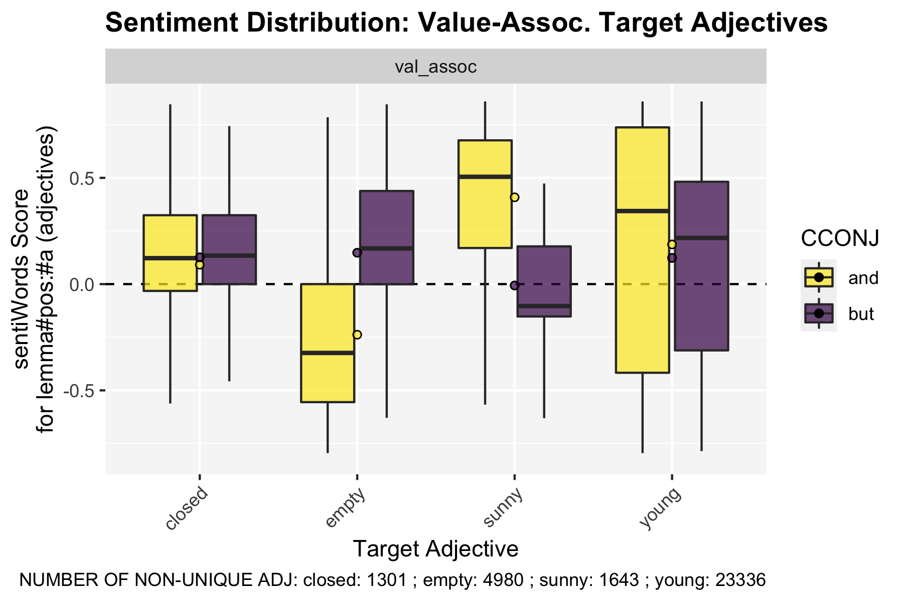

README
================
Lucien Baumgartner
8/12/2020

  - [The Project](#the-project)
  - [Study 1: Valence - Proof of
    Concept](#study-1-valence---proof-of-concept)
      - [Data](#data)
      - [Hypotheses](#hypotheses)
      - [Results](#results)

# The Project

So far we lack the means to distinguish thick concepts from descriptive
concepts without relying on intuitions, and to measure evaluative
intensity. Using a corpus-based approach, we show that thick adjectives
and descriptive adjectives behave differently when being combined with
the terms “and” and “but”. After having shown the validity of our
approach, we show how this method can help to answer questions in
different domains of discourse: We provide empirical data revealing that
thick concepts are used differently in legal contexts compared to
everyday language.

# Study 1: Valence - Proof of Concept

## Data

The data for the first corpus study are 256’838 target structures from
reddit comments (100 days; 09.02.20-19.05.20). The data was gathered
using the pushhift API via R.

  - SOURCE: [pushshift API](https://pushshift.io/api-parameters/) (last
    retrieved 19.05.2020, open data)

## Hypotheses

## Results

Average per word and conjunction (avg; n = number of cases):

    # A tibble: 40 x 5
    # Groups:   cat, TARGET [20]
       cat          TARGET    CCONJ      avg     n
       <chr>        <chr>     <chr>    <dbl> <int>
     1 desc         loud      and   -0.0150  16140
     2 desc         loud      but    0.200     411
     3 desc         narrow    and   -0.0485   2262
     4 desc         narrow    but    0.228     193
     5 desc         permanent and   -0.0109   1412
     6 desc         permanent but    0.0929     64
     7 desc         short     and    0.159   25549
     8 desc         short     but    0.341    3353
     9 non_moral_tc beautiful and    0.407   20628
    10 non_moral_tc beautiful but   -0.193    1634
    11 non_moral_tc dirty     and   -0.266    4560
    12 non_moral_tc dirty     but    0.284     200
    13 non_moral_tc funny     and    0.285   18502
    14 non_moral_tc funny     but   -0.142    2903
    15 non_moral_tc stupid    and   -0.341   19991
    16 non_moral_tc stupid    but    0.191    1611
    17 tc_high      brave     and    0.402    7020
    18 tc_high      brave     but   -0.342     615
    19 tc_high      cruel     and   -0.266    9638
    20 tc_high      cruel     but    0.335     338
    21 tc_high      honest    and    0.310   15119
    22 tc_high      honest    but    0.228     696
    23 tc_high      rude      and   -0.407   13973
    24 tc_high      rude      but    0.102     561
    25 tc_low       careless  and   -0.386    1014
    26 tc_low       careless  but   -0.0306      8
    27 tc_low       fair      and    0.233   18989
    28 tc_low       fair      but    0.0100    540
    29 tc_low       friendly  and    0.422   15235
    30 tc_low       friendly  but    0.0658    705
    31 tc_low       selfish   and   -0.396   18440
    32 tc_low       selfish   but    0.0162    326
    33 val_assoc    closed    and    0.0915   1181
    34 val_assoc    closed    but    0.126     120
    35 val_assoc    empty     and   -0.238    4808
    36 val_assoc    empty     but    0.148     172
    37 val_assoc    sunny     and    0.408    1585
    38 val_assoc    sunny     but   -0.00656    58
    39 val_assoc    young     and    0.187   22627
    40 val_assoc    young     but    0.123     709

 



Results of the ANOVA:

``` 
                    Df Sum Sq Mean Sq   F value   Pr(>F)    
TARGET_pol           3   6303  2101.0 15991.594  < 2e-16 ***
CCONJ                1      0     0.0     0.215    0.642    
cat                  2     29    14.4   109.932  < 2e-16 ***
TARGET_pol:CCONJ     3    758   252.8  1924.301  < 2e-16 ***
CCONJ:cat            2      7     3.4    25.526 8.26e-12 ***
Residuals        99988  13137     0.1                       
---
Signif. codes:  0 ‘***’ 0.001 ‘**’ 0.01 ‘*’ 0.05 ‘.’ 0.1 ‘ ’ 1
```
